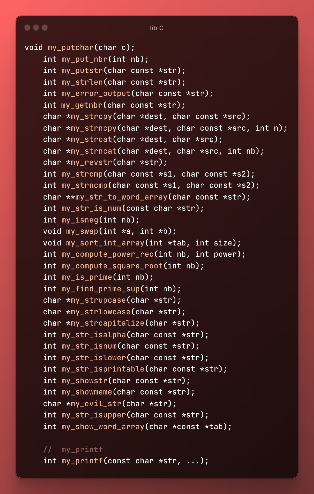

# Mini C library
> mini library repoducing most important C functions !
> made at epitech

Project is: _in progress_ kindda.

## Contents
* [Library functions](#library-functions)
* [Printf function](#printf-function)

* [Usage](#usage)
* [Contact](#contact)

## Library functions
Multiple functions are available in the library, here is a list of them:

all functions present

    - [x] my_putchar
    - [x] my_strlen.c
    - [x] my_putchar.c
    - [x] my_put_nbr.c
    - [x] my_strcmp.c
    - [x] my_strncmp.c
    - [x] my_putstr.c
    - [x] my_getnbr.c
    - [x] my_strcpy.c
    - [x] my_strcat.c
    - [x] my_strncpy.c
    - [x] my_strncat.c
    - [x] my_revstr.c
    - [x] my_isnum.c
    - [x] my_compute_power_rec.c
    - [x] my_compute_square_root.c
    - [x] my_error_output.c
    - [x] my_find_prime_sup.c
    - [x] my_is_prime.c
    - [x] my_show_word_array.c
    - [x] my_showmem.c
    - [x] my_showstr.c
    - [x] my_sort_int_array.c
    - [x] my_str_isalpha.c
    - [x] my_str_islower.c
    - [x] my_str_isprintable.c
    - [x] my_strlowcase.c
    - [x] my_strupcase.c
    - [x] my_swap.c
    - [x] my_str_to_word_array.c
    - [x] my_strcapitalize.c
    - [x] my_error_output.c
    - [x] my_printf.c
    - [x] my_putdouble.c
    - [x] my_putlong.c
    - [x] my_octal.c
    - [x] my_high_hexa.c
    - [x] my_low_hexa.c
    - [x] my_putptr.c
    - [x] my_binary.c
    - [x] my_nonprintable_char.c

Warning: some functions are not fully tested, and may not work as expected.

(basic functions do have full functionnalities)

## Printf function
Reproduction the printf function from the C library, with the following flags:

implemented flags

- [x] %d
- [x] %i
- [x] %c
- [x] %s
- [x] %o
- [x] %x
- [x] %X
- [x] %p
- [x] %b
- [x] %p
- [x] %S
- [x] %u
- [x] %f
- [x] %l

Supports the following formats as well :
- [x] '#'
- [x] ' '

Works perfeclty fine for one argument, but may not work as expected for multiple arguments.
This WILL get updated in the future.

## Usage
Reminder its a -42 for epitech students copying this code, so use it at your 
own risk.

(its also old code for the most which i'm really not proud of)

use in a terminal :

`make` to compile the library

`make clean` to compile and clean the library

`make re` to recompile and clean the library

## Contact
Created by [@underhoney](https://github.com/underhoney) - feel free to 
recommend me music !

<!-- ## License -->
<!-- This project is open source and available under the [... License](). -->

<!-- You don't have to include all sections - just the one's relevant to your project -->